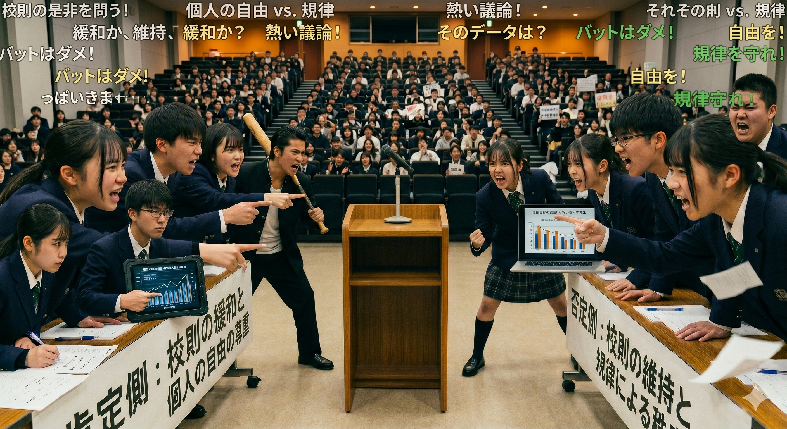

<link rel="stylesheet" href="my-theme.css">

**ゲーム分析応用/戦術・戦略プレゼンテーション**

# 理解促進②

2026.05.25

---

# 本日の内容

- 前回の振り返り{.fragment .fade-left}
- Sec1　プレゼン大会{.fragment .fade-left}
- Sec2　タスク準備{.fragment .fade-left}

---

# 前回の振り返り

|  | 画像等 | テキスト |
| --- | --- | --- |
| 処理速度 | ◎ 速い（瞬時に把握） | △ 遅い（読解が必要） |
| 記憶定着 | ◎ 残りやすい（画像優位性） | △ やや弱い |
| 正確性 | △ 誤解・曖昧さが出やすい | ◎ 正確に伝えやすい |
| エンゲージ | ◎ 反応・感情も伝わる | △ 伝えにくい |

---

# Section1
スポーツ科学を語らおう！
<!-- .slide: data-transition="slide" data-background="#00b2bc" data-background-transition="zoom" -->

---

# Section2
タスク準備
<!-- .slide: data-transition="slide" data-background="#00b2bc" data-background-transition="zoom" -->

- タスクテーマ{.fragment .fade-left}
- タスクの概要{.fragment .fade-left}
- タスクの制約{.fragment .fade-left}

---

## タスクテーマ

面白き事もなき講義を面白く。{.fragment .fade-left}

すみなすものは提案なりけり。{.fragment .fade-left}

---

## タスクの概要（舞台設定）

- 皆さんは幕末の志士としてこの世（講義）を改革します{.fragment .fade-left}
- 「こんな内容を講義で扱うべきだ！」という熱い提案で時代を動かしてください{.fragment .fade-left}

---

## タスクの概要

- 「こんな内容（タスク）を講義で扱ったら面白いのでは」というアイデアを募集します{.fragment .fade-left}
- 本タスクはグループタスクとします{.fragment .fade-left}
- 本タスクは課題点の対象外です{.fragment .fade-left}

---

## タスクの制約①

- 提案は以下のアウトラインに沿って構成する{.fragment .fade-left}
  - (タイトル){.fragment .fade-left}
  - 提案するアイデア{.fragment .fade-left}
  - プレゼンに重要な要素とその理由（背景）{.fragment .fade-left}
    - 重要な要素とは（複数可）{.fragment .fade-left}
    - 重要だと考えた理由・根拠{.fragment .fade-left}
  - 重要な要素を踏まえた講義アイデア{.fragment .fade-left}
    - なぜこのアイデアが有効なのか{.fragment .fade-left}
    - アイデアの詳細（実施方法・ルールなど）{.fragment .fade-left}
  - 結論{.fragment .fade-left}

---

## タスクの制約②

- ドキュメントの作成は任意{.fragment .fade-left}
- プレゼンはスライドを用いる{.fragment .fade-left}
- 主張を支える参考文献を1つ以上用いる{.fragment .fade-left}

---

## サンプル: 
## 論理的思考力を強化する講義アイデアの提案{.fragment .fade-left}
<!-- .slide: data-background="#5c5c5c" -->

---

###  提案するアイデア

 

## 論理的思考力を養うディベート対決！{.fragment .fade-left}
<!-- .slide: data-background="#5c5c5c" -->

---

## プレゼンに重要な要素とその理由
<!-- .slide: data-background="#5c5c5c" -->

---

### 重要な要素とは（提案の背景）

 

  - 美しいスライド（見た目）{.fragment .fade-left}
  - 巧みな話術（伝え方）{.fragment .fade-left}
  - 論理的な構成（内容）{.fragment .fade-left}

 
 

- 昨今、見栄えや話し方などのスキルばかりが重要視されている{.fragment .fade-left}
- そこで本提案では「論理的な構成」に焦点をあてた提案を行う{.fragment .fade-left}
<!-- .slide: data-background="#5c5c5c" -->

---

### なぜ論理的な構成が重要なのか

- プレゼンの最終目的は、対象者の行動を喚起すること{.fragment .fade-left}
- 故に相手に「いかにして納得してもらうか」が重要{.fragment .fade-left}
- 論理的な構成は「納得形成」を強力に支援する{.fragment .fade-left}
- Richard E. & John T. (1986)の研究によると、{.fragment .fade-left}
	- 深いレベルで納得し変容された行動は、長期に渡って持続されることが証明されている{.fragment .fade-left}
	- （参考文献）The Elaboration Likelihood Model of Persuasion{.fragment .fade-left}
<!-- .slide: data-background="#5c5c5c" -->

---

####   論理的思考力を養うために

  
  

    <h1 class="fragment fade-left media-overlay__caption">ディベートの導入</h1>
  

<!-- .slide: data-background="#5c5c5c" -->

---

### なぜディベートが有効なのか

- ディベートは、特定の議題について「賛成 vs 反対」の構図でどちらがより論理的な説明ができるかを競う討論形式{.fragment .fade-left}
- 審判（第三者）をいかに納得させられるかが問われ、「論理的思考力」の獲得につながる{.fragment .fade-left}
- 既に、論理的思考力を含む多様な能力の開発を目的に教育現場などで導入されている{.fragment .fade-left}
- 市川 裕理(2018)の研究ではディベートを教材として使用した場合の論理的思考力の獲得について言及されている{.fragment .fade-left}
- （参考文献）English Debating to Encourage Impromptu Speaking{.fragment .fade-left}
<!-- .slide: data-background="#5c5c5c" -->

---

### 実施方法

- **概要**: 賛成5名 vs 反対5名。議題は事前配布{.fragment .fade-left}
- **流れ**:{.fragment .fade-left}
	- ルール説明（5分）{.fragment .fade-left}
	- 陣営で論点整理（15分）{.fragment .fade-left}
	- 立論・反論・自由討論・総括（25分）{.fragment .fade-left}
	- 講評・振り返り（15分）{.fragment .fade-left}
- **ルール**: 根拠つきで発言／人格否定・感情論のみは不可／1発言2分・挙手制{.fragment .fade-left}
<!-- .slide: data-background="#5c5c5c" -->

---

## まとめ

- 講義でディベートを実施しよう{.fragment .fade-left}
- ディベートはプレゼンに必須な「論理的思考力」の獲得に有効{.fragment .fade-left}
- TSRの論破王こと「TSRひろゆき」を決めようじゃないか！{.fragment .fade-left}
<!-- .slide: data-background="#5c5c5c" -->

---

# 以上です。ご清聴ありがとうございました

<!-- .slide: data-background="#5c5c5c" -->

---

**次週、予告。** {.fragment .fade-left}

## 「おもろいアイデア募集！ただし、ネタ切れなわけではない！」{.fragment .fade-left}
