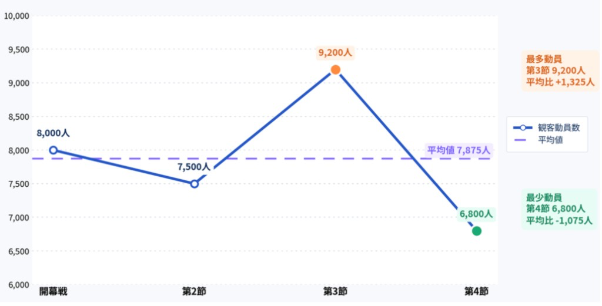

<link rel="stylesheet" href="my-theme.css">

**ゲーム分析応用/戦術・戦略プレゼンテーション** 
# プレゼンテーションの役割
2026.04.13

---

# 本日の内容

- Sec.1 前回のあらすじ＆タスク {.fragment .fade-left}
- Sec.2 プレゼンテーションの役割 {.fragment .fade-left}
- Sec.3 次回タスクの説明 {.fragment .fade-left}

---

# Section1
前回のあらすじ＆タスク
<!-- .slide: data-transition="slide" data-background="#00b2bc" data-background-transition="zoom" -->
- 前回のあらすじ {.fragment .fade-left}
- タスク {.fragment .fade-left}

---

## 1-1 前回のあらすじ

- 受講ルール {.fragment .fade-left}
- 講義概要 {.fragment .fade-left}

---

### 受講ルール

- 飲水は可。ただし蓋付き容器など中身がこぼれないものに限る {.fragment .fade-left}
- 学習パフォーマンス向上を目的とするものは基本的に可。 ただし以下のものついては注意する場合有{.fragment .fade-left}
    - 他者の学習の妨げになるもの {.fragment .fade-left}
    - 講義の進行に影響を及ぼすもの {.fragment .fade-left}
    - 学則に違反するもの {.fragment .fade-left}
- 本講義においては生成AI含むAIアプリケーションの使用は原則認める {.fragment .fade-left}
- その他のルールについては基本的に学則に準じる {.fragment .fade-left}
- 一緒に良い授業をつくりましょう {.fragment .fade-left}

---

### 目指すところ

- 現場で活躍するための４つの力の獲得 {.fragment .fade-left}
    - 言語化力：問題を言語化し組織の共通理解を得る {.fragment .fade-left}
    - 提案力：問題に対して具体的な改善策を提案する {.fragment .fade-left}
    - 遂行力：計画された案を実現する {.fragment .fade-left}
    - 問題発見力：得られた結果から新たな問題を発見する {.fragment .fade-left}
- 本講義では特に提案力（プレゼンテーション）の強化に焦点を当てる {.fragment .fade-left}

---

### 講義の構成

- 前期では、{.fragment .fade-left}
    - 現場で求められるプレゼンテーションの基礎的な役割（情報共有・理解促進・納得形成・行動喚起）を普遍的なテーマを通して身につける {.fragment .fade-left}
- 後期では、{.fragment .fade-left}
    - 各学生ごとの進路に沿ったテーマを通してアウトプットの経験を積むとともに、プレゼンテーションに役立つ各種ツールに触れる {.fragment .fade-left}
- 講義は基本的に50分×3の3部構成で展開（インターバル10分） {.fragment .fade-left}

---

### 講義中大切にしてほしいこと

> Done is better than perfect
 完璧を目指すよりまず終わらせろ
> {.fragment .fade-left}

---

### その他

- 評価等については[初回スライド](https://omochibose.github.io/tsr_tacticalPresentation/lecture01/)を参照のこと {.fragment .fade-left}

---

## 1-2 タスク

- タスク概要 {.fragment .fade-left}
- 実践 {.fragment .fade-left}

---

### タスク概要

- テーマは「私について」 {.fragment .fade-left}
- プレゼンには何を用いても（用いなくても）可 {.fragment .fade-left}
- 持ち時間は一人3分間（±30秒に留めること） {.fragment .fade-left}

---

### 実践

- 早速やってみよう！ {.fragment .fade-left}

---

# Section2
プレゼンテーションの役割
<!-- .slide: data-transition="slide" data-background="#00b2bc" data-background-transition="zoom" -->
- プレゼンテーションの４つの役割 {.fragment .fade-left}
- プレゼンテーションとは {.fragment .fade-left}
- プレゼンで大切な心得 {.fragment .fade-left}

---

## Question
プレゼンテーションとは？

- 今までにどんなプレゼンをしたことがある？ {.fragment .fade-left}
- どんなシチュエーション？ {.fragment .fade-left}
- どんな目的？ {.fragment .fade-left}
- プレゼンテーションとはなんだろう？ {.fragment .fade-left}

---

## プレゼンテーションの役割

- プレゼンテーションには以下４つの役割（機能）がある {.fragment .fade-left}
    1. 情報伝達 {.fragment .fade-left}
    2. 理解促進 {.fragment .fade-left}
    3. 納得形成 {.fragment .fade-left}
    4. 行動喚起 {.fragment .fade-left}

---

### ①情報伝達

- 情報（Infomation）を正しく伝えること {.fragment .fade-left}
- データ（Data）と情報（Infomation）は異なる {.fragment .fade-left}
    - Data：客観的な事実、数値、文字、記号の羅列。それ自体に意味はない {.fragment .fade-left}
    - Info：データに文脈・意味・解釈を付与したもの。意思決定を支援する材料 {.fragment .fade-left}
- Data Analystとは、データを分析し情報に変換することで意思決定を支援する者 {.fragment .fade-left}
- データから情報への変換時、事実と意見が混同しやすい点に注意 {.fragment .fade-left}

---

#### 例）事実と意見の混同

次の表を見て、チームAがどんなチームか考えてみよう

---

|  | シュート数 | パス数 | 被ゴール数 |
| --- | --- | --- | --- |
| チームA | 15 | 50 | 3 |
| チームB | 10 | 30 | 1 |
| チームC | 6 | 20 | 0 |

---

- 事実） {.fragment .fade-left}
    - シュート数が他チームより多い {.fragment .fade-left}
    - パス数が他チームより多い {.fragment .fade-left}
    - 被ゴール数が多い {.fragment .fade-left}
- 意見） {.fragment .fade-left}
    - 攻撃が得意なチームである（本当に得意なのか？） {.fragment .fade-left}
    - ディフェンスが苦手なチームである（本当に苦手なのか？） {.fragment .fade-left}
- 抽象化（データ→情報）にはバイアスがかかりやすい {.fragment .fade-left}

---

### ②理解促進

- 受け手にとって理解がし易いように情報を整形すること {.fragment .fade-left}
- 受け手の属性によって正解となるアプローチは異なる {.fragment .fade-left}
- 故に、理解促進のためのテクニック・手法は多数存在する {.fragment .fade-left}

---

#### 例）あなたなら次の文章をどう伝える？

---

**文章の例**

「今シーズンの観客動員数は、開幕戦が8,000人、第2節が7,500人、第3節が9,200人、第4節が6,800人でした。」

---

**グラフの例**

---

### ③納得形成（合意形成）

- 提案の内容を「なるほど、その通りだ」と腹落ちしてもらうこと {.fragment .fade-left}
- 「理解すること」と「納得すること」は違う {.fragment .fade-left}
    - あえて言うなら… {.fragment .fade-left}
        - 理解は脳でする {.fragment .fade-left}
        - 納得は心でする {.fragment .fade-left}
- 納得形成はプレゼンテーション以外の要素も影響 {.fragment .fade-left}
    - 誰が言っているか（肩書き、信頼関係） {.fragment .fade-left}
    - タイミングなど {.fragment .fade-left}

---

#### ちょっとブレイク

理解できるけど納得いかない経験はありますか？{.fragment .fade-left}

---

### ④行動喚起

- 対象（受け手）に特定の行動を促すこと {.fragment .fade-left}
- 行動喚起こそプレゼンの最終目的 {.fragment .fade-left}
- 一方で、ここへのコミットは不足しやすい {.fragment .fade-left}
- 知ってもらう、理解してもらう、納得してもらうだけでは成果に直結しない {.fragment .fade-left}

---

## プレゼンテーションとは

- 対象に意図した行動をしてもらうためのもの {.fragment .fade-left}
    - そのために、納得してもらう {.fragment .fade-left}
    - そのために、理解してもらう {.fragment .fade-left}
    - そのために、正しく知ってもらう {.fragment .fade-left}
- プレゼンとは、上記のためのプロセスでありツールである {.fragment .fade-left}
- プレゼン自体が目的化することはない {.fragment .fade-left}

---

## プレゼンで大切な心得

- 目的は明確にしよう {.fragment .fade-left}
- プレゼンは贈り物 {.fragment .fade-left}

---

### 目的は明確にしよう

- プレゼンの成功とは {.fragment .fade-left}
    - 目的を達成したかどうかで決まる {.fragment .fade-left}
- 何がプレゼンの目的（ゴール）なのか、はじめに分析する必要がある {.fragment .fade-left}

---

### プレゼンは贈り物

- PresentationはPresent（贈り物）に由来する言葉である {.fragment .fade-left}
- 往々にしてプレゼンテーションは一方的な発話・提案になり易い {.fragment .fade-left}
- だが、その本質は言葉の由来通り贈り物に近い {.fragment .fade-left}
    - 相手を喜ばせるために {.fragment .fade-left}
    - 相手を理解し {.fragment .fade-left}
    - 相手が期待するもの（あるい裏切るもの）を提供する行為 {.fragment .fade-left}
- つまり、プレゼンは相手の立場になって構成する必要がある {.fragment .fade-left}
- 自分があげたいものでは相手は喜ばない {.fragment .fade-left}

---

## まとめ

- プレゼンテーションには４つの機能がある {.fragment .fade-left}
    - 情報伝達 {.fragment .fade-left}
    - 理解促進 {.fragment .fade-left}
    - 納得形成 {.fragment .fade-left}
    - 行動喚起 {.fragment .fade-left}
- 行動喚起（相手に意図した行動をしてもらうこと）が最終目的 {.fragment .fade-left}
- プレゼンの成功とは、目的が達成されたかどうかで決まる {.fragment .fade-left}
- プレゼンを成功させるために大切なことは {.fragment .fade-left}
    - まず目的を明確にすること {.fragment .fade-left}
    - 相手の気持ち・立場になって構成すること {.fragment .fade-left}

---

# Section3
次回タスクの説明
<!-- .slide: data-transition="slide" data-background="#00b2bc" data-background-transition="zoom" -->
- タスクテーマ {.fragment .fade-left}
- タスクの制約 {.fragment .fade-left}
- タスク分析 {.fragment .fade-left}

---

## タスクのテーマ

みんなにお勧めしたい私のライフハック{.fragment .fade-left}

---

## タスクの制約

- 本タスクは課題点の対象となる {.fragment .fade-left}
- 本タスクはドキュメントベース（Word）での提出とする {.fragment .fade-left}
- 提出期限は第３回講義終了時点 {.fragment .fade-left}
- 本タスクを基に第４回授業時に口頭プレゼンを実施 {.fragment .fade-left}

---

## タスクの分析

- このタスクでの目的を考えてみよう {.fragment .fade-left}
- 目的： {.fragment .fade-left}
    - クラスの人にライフハックを取り入れてもらうこと {.fragment .fade-left}

---

**次週、予告。** {.fragment .fade-left}
## 「プレゼンなのになぜWord？ ドキュメントベースがもたらす知られざる価値」 {.fragment .fade-left}
