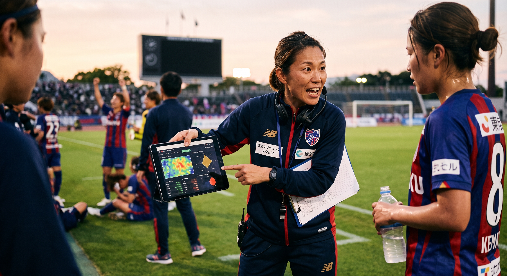
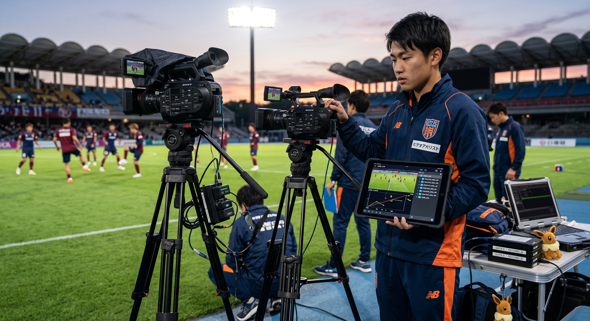
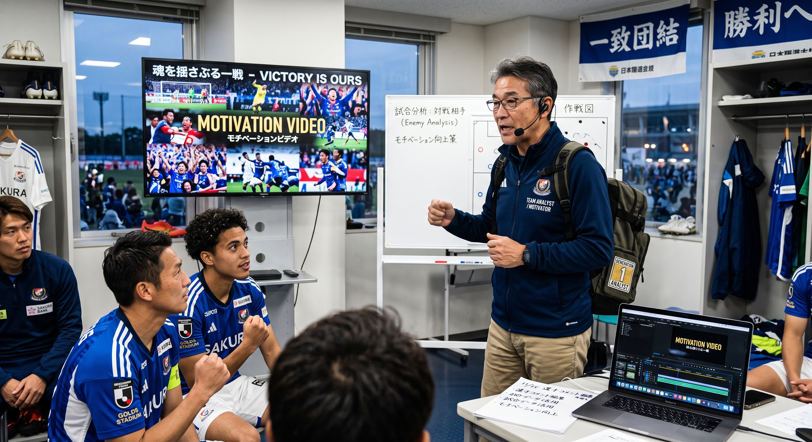
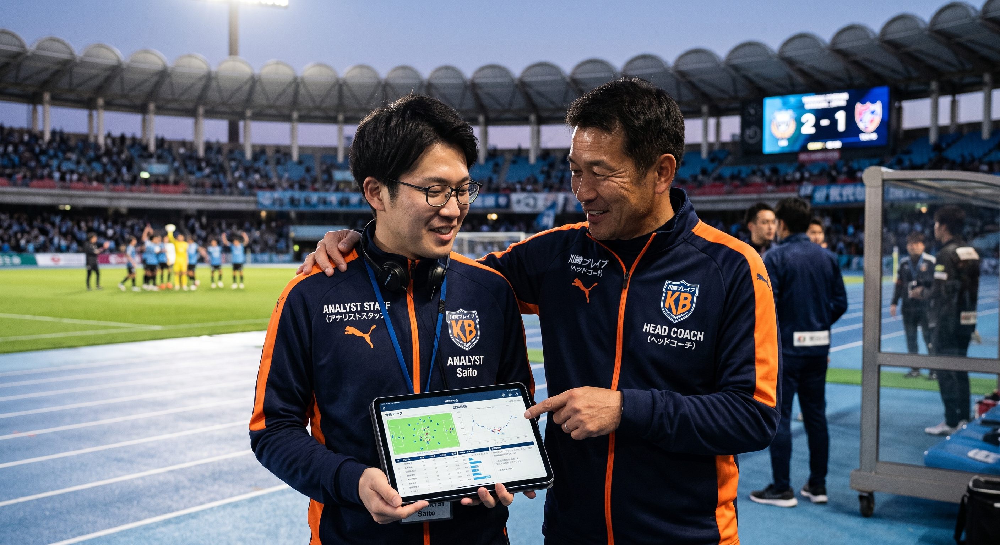
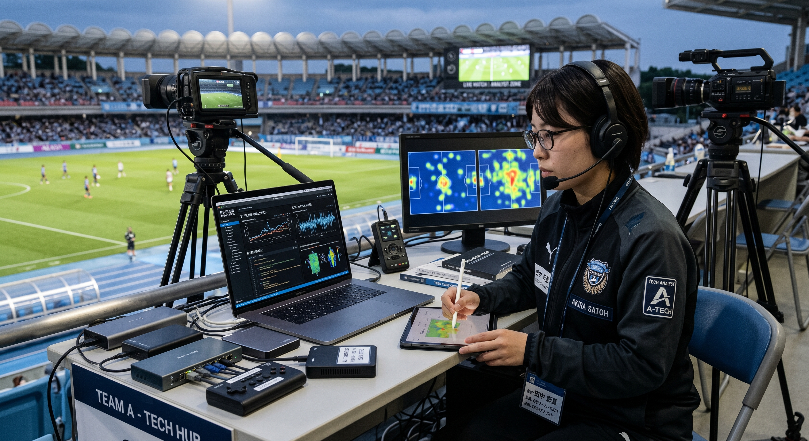
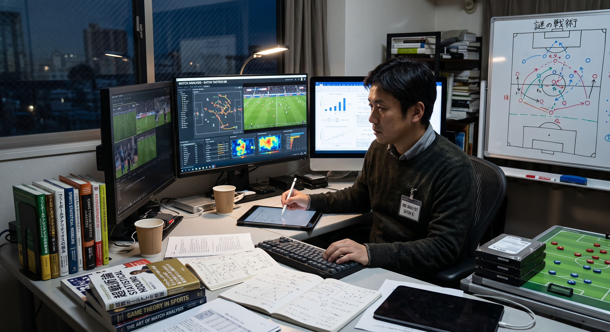

<link rel="stylesheet" href="my-theme.css">

**順天堂大学 スポーツ数理科学研究室**

# アナリストの仕事

2026.09.04

---

<!-- .slide: data-transition="slide" data-background="#00b2bc" data-background-transition="zoom" -->
## 自己紹介

---

<!-- .slide: data-transition="slide" data-background="#00b2bc" data-background-transition="zoom" -->
# アナリストの仕事
- アナリストって何するの{.fragment .fade-left}
- 求められるスキル{.fragment .fade-left}

---

## 知られざる廣津ゼミの凄さ

---

### Question:

この数字はなんだろう？{.fragment .fade-left}

$$\frac{3}{26}$$ {.fragment .fade-left}

---

### 知られざる廣津ゼミの凄さ
- 2025-26シーズン JRLOに所属するチーム数 26（今期から27）{.fragment .fade-left}
- うち、廣津ゼミ出身（修士含む）のヘッドアナリスト数 3人{.fragment .fade-left}
- 実質ラグビー界は廣津先生が牛耳っていると言っても過言ではない{.fragment .fade-left}
- いや、それは過言{.fragment .fade-left}
- この他にも各種方面で活躍する廣津チルドレンが多数{.fragment .fade-left}
- ここ10年で確実に世界一に近づいている{.fragment .fade-left}
- 皆さんの師事する廣津先生は思っているより凄い{.fragment .fade-left}

---

## アナリストって何するの
- 先述の通り、何を隠そう私も3人のラグビーHAのうちの一人{.fragment .fade-left}
- ただし現在はその限りではない（昨期、革命を企てて無事クビに）{.fragment .fade-left}
- 辞めたてほやほやのアナリストは希少価値が高いということで{.fragment .fade-left}
- アナリストの仕事の一端をお話しできればと思います{.fragment .fade-left}

---

### アナリストの4大業務
- アナリストの仕事は大きく分けると4つ{.fragment .fade-left}
	1. 撮影：練習・試合時の撮影、複数人で行う{.fragment .fade-left}
	2. データ収集：撮影した映像を元にデータを集計する{.fragment .fade-left}
	3. 分析：集計したデータを元にチーム・選手の課題解決を支援{.fragment .fade-left}
	4. プレゼン（アウトプット）：分析した結果を伝える{.fragment .fade-left}
- 最も時間を要するのは「データ収集」{.fragment .fade-left}
- いわゆる「分析」を行う時間は限られている{.fragment .fade-left}
- 「ビデオアナリスト」と呼称されるケースも多く映像を扱う機会がとても多い{.fragment .fade-left}

---

### 分析官とは名ばかり！アナリストの実態

---

### Question：
アナリストのイメージってどんな感じ？{.fragment .fade-left}

---

### 分析官とは名ばかり！アナリストの実態
- アナリストという職名は職務・職能を正しく説明できていないと思う{.fragment .fade-left}
- 先述の通り、アナリストは分析以外の業務がとても多い{.fragment .fade-left}
- 同じラグビーでもチームごとにやっていることが違う{.fragment .fade-left}
- 故に、多様なアナリストが存在することも事実{.fragment .fade-left}

---

### 多様化するアナリスト、あなたはどのタイプが理想？
- アナリストはまだスキルの標準化がされておらず、職務も人によってまちまち{.fragment .fade-left}
- いろいろなアナリストが存在を許されていることは、捉え方によってはこの職業の魅力とも言える（個性が光る）{.fragment .fade-left}
- ここでは現在生息が確認されているアナリストの種類を紹介{.fragment .fade-left}
- 偏見が多分に含まれるが、刮目して見てほしい{.fragment .fade-left}

---

### コーチング型アナリスト

- 将来コーチをやりたいと思っている、あるいは分析内容を選手にFBする快感に目覚めてしまったタイプ。{.fragment .fade-left}
- その種目の競技歴自体も豊富なことが多く、ドメイン知識が武器。{.fragment .fade-left}
- 生息数は比較的多く正統派といえる。熱い人が多い傾向{.fragment .fade-left}

---

### ビデオアナリスト

- ビデオコーディネーターとも呼ばれる。練習・試合時の撮影および管理を主業務とする。{.fragment .fade-left}
- アシスタントアナリストとして誰しもが通る形態であり、ポケモンでいうイーブイ。{.fragment .fade-left}
- もっとも生息数が多い。需要は尽きないが、業務の単純さ故かここにとどまりたい人は希有。{.fragment .fade-left}

---

### モチベーター型アナリスト

- モチベーションビデオの作成に長けたアナリスト。{.fragment .fade-left}
- 選手からの評価が高く、制作物も見えやすいのでチームからの需要は高い。{.fragment .fade-left}
- ここ最近は生息数が減少傾向（井上調べ）。いわゆるアナリスト第一世代に多い印象。{.fragment .fade-left}

---

### HC右腕型アナリスト

- ヘッドコーチ（HC）の依頼にすべて応える右腕参謀的なアナリスト。{.fragment .fade-left}
- HCからの信頼がとにかく厚く、相思相愛の関係であることが多い。HCと一緒に移籍するため発見しやすい。{.fragment .fade-left}

---

### Tech型アナリスト

- とにかく機械に強いアナリスト。業務の効率化を得意とし、分析ソフトの扱いなどにも長ける。{.fragment .fade-left}
- 競技自体よりも機械への興味が上回っていることもしばしばで、いずれスポーツテック企業に転身する。{.fragment .fade-left}

---

### ギーク型アナリスト

- その種目に異常なほど詳しい最もアナリストっぽいアナリスト。{.fragment .fade-left}
- チームに所属していない野良のアナリストも確認されており、自分の好きを極めた究極形態。{.fragment .fade-left}
- 知識量とは裏腹に競技歴が少ない、あるいは0であることも多く、その生態は謎に包まれている。{.fragment .fade-left}

---

## 求められるスキル・素養
ここでは今現場で求められている具体的なスキルを解説

---

### JSAAの定義によれば
日本スポーツアナリティクス協会（JSAA）はSAのスキル標準を公開（2025年8月）
- 捉える
- 収集・測定する
- 分析する
- 利活用する
- マネジメントする

---

### 井上の経験則から
- 月並みだがコミュ力は大切{.fragment .fade-left}
	- 分析が高度化→コーチ、選手、スタッフとのギャップは拡大{.fragment .fade-left}
	- 相手のレベルに合わせて適切な意思疎通ができる力＝コミュ力{.fragment .fade-left}
- 見落とされがちだがアナリストは個人事業であることが多い{.fragment .fade-left}
	- 自分を売り込むこと{.fragment .fade-left}
	- 経済的な不安定性に耐える素質も重要 {.fragment .fade-left}

---

# スポーツと一般企業
データ利活用の共通点と相違点

---

### 共通点と相違点
- スポーツ業界限らず一般企業もデータの利活用には前向き{.fragment .fade-left}
- スポーツでのデータ知見が活きることも多いが相違点もある{.fragment .fade-left}
- 共通点：分析サイクル（収集→分析→利活用）{.fragment .fade-left}
- 相違点：目的変数の数（スポーツは目的が一致しやすい）{.fragment .fade-left}
- 一般社会では、より分析の目的意識「問いを立てる」力が求められる{.fragment .fade-left}

---

## 最後に：卒論を控えている学生の皆さんへ
- 卒論は「卒業するため」の論文である{.fragment .fade-left}
- 卒論は「卒業した後のため」の論文でもある{.fragment .fade-left}
- 私自身、キャリア形成に卒論が役立ったケースがしばしば{.fragment .fade-left}
- せっかくやるなら最低限ではなく、最大限を目指すと良いと思います{.fragment .fade-left}
- いずれにせよ、あなたの今が将来の自らを助ける{.fragment .fade-left}

---

# ご清聴ありがとうございました
